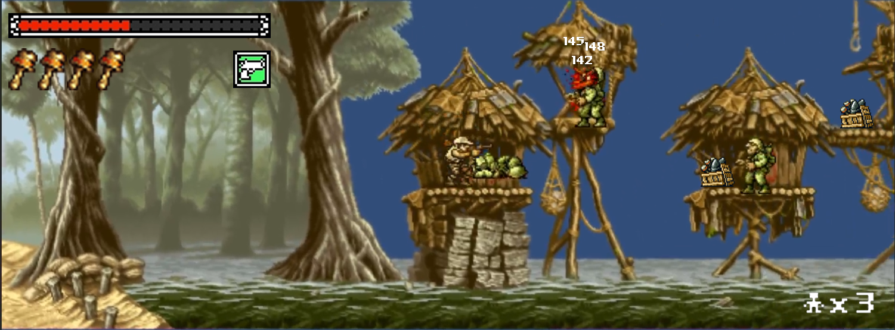
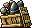
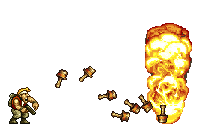

ChapmanMetalSlug
================

CPSC 340 2d Side Scroller Shooter

#Design Document

Contents
-------------
1. [Game Overview] (#gameplayoverview)
2. [Gameplay Mechanics] (#gameplaymechanics)
3. [Controls] (#controls)
4. [Interface] (#interface)
5. [Story] (#story)
6. [Game World and Levels] (#gameworld)
7. [Game Progression] (#progression)
8. [Characters] (#characters)
9. [Enemies] (#enemies)
10. [Weapons] (#weapons)
11. [Script] (#script)
12. [Scoring] (#scoring)
13. [Bonuses] (#bonuses)
14. [Design Notes] (#notes)
15. [Weekly Blog Posts](#posts)
16. [Future Features] (#futurefeatures)

Version History
---------------------

Version | Draft | Description
-----------|--------|-----------------
Draft | 10/2/2014 | Initial Draft

##Gameplay Overview

This game will be a classic side scroller 2D shooter that would resemble games such as Metal Slug and Contra. The story is not currently set, I have been debating with several ideas that revolve around a Rambo-like story of infiltrating an enemy compound, either saving people and blowing something up (or both), and facing a boss.

##Gameplay Mechanics

Class arcade style of 2D Shooter Platformer. Main focus is to utilize a Xbox controller to control the movement and aiming with separate joysticks.

Sample gameplay can be found in my [Weekly Blog Posts](#posts) and will constantly be updated on my thought process of the game until release.

##Controls
Following Unity's [Xbox360 Controller Mapping](http://wiki.unity3d.com/images/a/a7/X360Controller2.png):

    - Left Joystick
      - Movement of player
    - Right Joystick
      - Alignment of weapon
    - A
      - Jump
    - B
      - Grenades (Maybe aimable and changed)
    - Right Trigger
      - Shooting

##Interface

1. Health Bar
  - Current health of player
2. Grenade Ammo
  - Shows current number of grenades
3. Current Weapon
  - Will show current weapon player is holding
4. Damage
  - Enemies will have their lost hitpoints hover as shot
  - Most likely will be implemented for boss fights
5. Lives
  - Amount of lives the player has left until "Continue?"

##Story
You play as a commando who is fighting against the Germans and the Russians, since the Molotov–Ribbentrop Pact held and united Russia and Germany as allies. Which means Hitler wouldn't of overextended his forces into Russia, causing Germany to lose the war. Without the east to worry about, he focuses his attention to the west and south, successfully developing a foothold in the UK and Africa and prolonging the war past 1945. The story is inspired by my series, Red Alert, developed by Westwood Studios (pre-RA3 obviously).

##Game World and Levels

Since this story is about post WW2, it can occur in locations world wide. Most likely locations might be more broad and international in beginning levels, ending towards levels getting closer and closer and within Germany and Russia.

Levels will incorporate a more military-futuristic style, since these two heavy hitters of the world have top scientists building advanced weapon systems

##Levels

As far as now, their are 2 levels without any story. First level incorporates a setting with Germany enemies, and the second incorporating Russian enemies.

Future levels will be purposed with the story, ranging from metropolitan cities to advanced top secret military bases in the middle of nowhere.

I greatly enjoyed the Commandos series by Pyro Studios and it would have a level development similar to that. In respect to cities, bases, and wilderness.

##Game Progression

Progression would consist of getting through levels and accomplishing missions for the further development of the story. Some customization could be implemented but that is currently undecided. I am going for a Metal Slug-esque game which could go either way.

##Characters

Main hero/commando that is general badass. Might be customizable in the future.

##Enemies

Typical bad guy army enemies that are clueless compared to yourself.

##Weapons

Machine Gun - Main weapon that has infinite ammo
Rocket Launcher - Launcher that deals splash damage and is a pick up for a limited time duration
Grenade - Throwable grenade that is thrown in an arc in player direction. Deals splash damage.

##Script

##Scoring

##Bonuses

##Design Notes

##Weekly Blog Posts
1. [Initial Panic](http://jacks205.blogspot.com/2014/09/week-1-initial-panic.html)
2. [Not Much Panic](http://jacks205.blogspot.com/2014/09/week-2-not-much-panic.html)
3. [Week 3: Who Do I Shoot?](http://jacks205.blogspot.com/2014/10/week-3-who-do-i-shoot.html)
4. [Week 4: New Style and Progess!](http://jacks205.blogspot.com/2014/10/week-4-new-style-and-progess.html)
5. [Week 11: New Levels and Better Features](http://jacks205.blogspot.com/2014/12/week-11-new-levels-and-better-features.html)

##Future Features

